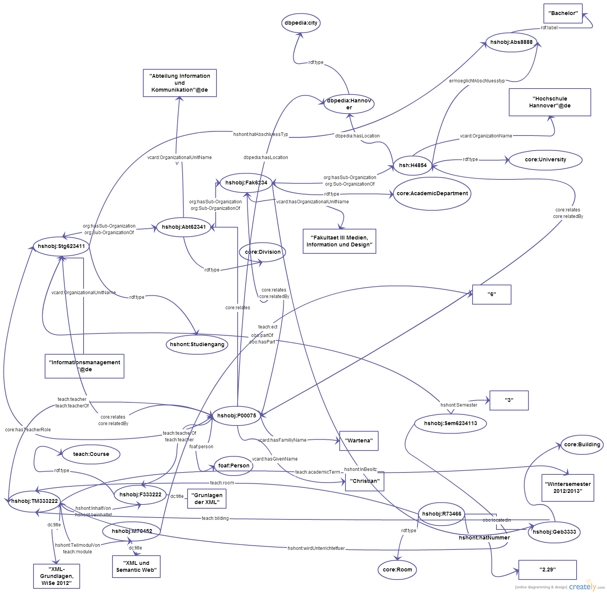

## Einleitung

Aktuell beschäftigen sich einige wissenschaftliche und akademische Einrichtungen mit der semantischen Vernetzung ihrer Daten. Die vorliegende Arbeit behandelt die Anwendung von semantischen Technologien (Linked Data und RDF) an den Hochschulen. Ziel dieser Arbeit ist, zu untersuchen, welche Hochschulen Linked Data Technologien anwenden und welchen Nutzen das für die Hochschule bringt. Ferner soll es versucht werden, die Struktur der Fakultät III, der HSH (Hochschule Hannover) in RDF-Syntax darzustellen. Zur Erreichung dieser Ziele werden die, in Linked Open Data Initiativen, involvierten Hochschulen recherchiert. Auf RDF als notwendige Komponente der Linked Data wird ebenso eingegangen. Im Hauptteil der Arbeit soll eine exemplarische Beschreibung der Fakultaet III der HSH mithilfe von RDF und bestehenden Vokabularen erstellt werden. Zu diesem Zweck werden unterschiedliche Ontologien untersucht. Dabei sind  die, im Zuge der Beschreibung entstehende Problemfälle, die Vorgehensweise und das Ergebnis zu erläutern. Die verlinkten Daten sollen in einer Graphik illustriert werden.   

## RDF und Linked Open Data  

### RDF

Die Datenvolumen und Datenvielfalt, besonders in der Forschung und Wissenschaft, wachsen stetig. Um diese Daten für alle offen zugänglich zu machen, werden Linked Data Technologien eingesetzt. Mithilfe von diesen Technologien werden die Daten miteinander verlinkt. Auf diese Weise bilden sie ein Netz aus auf sich gegenseitig verweisenden Daten, die suchbar und gemeinsam nutzbar sind. [@Wikipedia2013, Linked Open Data] RDF ein notwendiger Bestandteil des Linked Open Data. Hitzler definiert RDF als "eine formale Sprache für die Beschreibung strukturierter Informationen." [@Hitzler2008, S.35]. Das Resource Description Framework (RDF) wurde zur Datenbeschreibung im WWW entwickelt, da die Sprache den Austausch und das Verknüpfen von Daten im Web ermöglicht. Die Daten verlieren dabei nicht ihre ursprüngliche Bedeutung. [@Hitzler2008, S.35]. Dem RDF liegt zugrunde ein Graphen-Model, was aus Knoten und Kanten besteht. Die Knoten sind die Ressourcen, die Kanten stellen die Beziehungen zwischen den Ressourcen dar. Sowohl die konkreten Objekte als auch die Beziehungen zwischen ihnen oder ihre Zuordnung zu abstrakten Konzepten erhalten eine eindeutige Kennzeichnung durch die URIs (United Ressource Identifier). [@Hitzler2008, S.38] 
Die URIs ähnlen in ihrer Struktur den URLs und werden nach dem gleichen Konstruktionsschema aufgebaut. Im Gegensatz zu URLs sind sie lediglich Verweise auf konkrete Personen oder Objekte und sind deshalb nicht im Internet abrufbar. [@Hitzler2008, S.38]

### RDF und Linked Universities

Der Zusammenschluss  Linked Universities vereint die europäischen Universitäten und Hochschulen, die Informationen über Lehrende, Studierende, Lehrveranstaltungen usw. als Linked Data im Web darstellen. Mithilfe von RDF, URIs und Ontologien vernetzt Linked Data diese Informationen, macht sie auffindbar,  zugänglich und nutzbar. [@LinkedUniversities2014]
Die zentralle Idee ist, dass die Daten von verschiedenen Institutionen den gemeinsamen Bereich im Web, das so gennante Web of University Data, bilden. Zur Zeit sind das nur einige europäische Universitäten, die  für die Erfassung und Verknüpfung ihrer öffentlichen Informationen Linked Data Technologien nutzen. [@LinkedUniversities2014]
Auf dem Portal Linked Universities findet Austausch über Instrumente zur technischen Umsetzung der Linked Data und kollaboratives Arbeiten an den Ontologien, die für universitäre Objekte und Konzepte wie: Course, Module, Teacher, genutzt werden können, statt. [@LinkedUniversities2014] Das Portal bietet Auflistung der Instrumente zur Verarbeitung der Daten wie z. B.: Google Refine o.a. [@LinkedUniversities2014tools] Zudem gibt Linked Universities eine Aufstellung der existierenden Ontologien.[@LinkedUniversities2014vocab] Links zu den Data Sets der Mitglieder - Universitäten sind ebenfalls gegeben.[@LinkedUniversities2014datasets]

### RDF an der Universität Münster

Eins der Mitglieder der Linked Universities ist die Universität Muenster. 
Die Universität stellt im Rahmen der Initiative LODUM (Linked Open Data University of Münster) ihre administrativen Daten:  Fachbereiche, Mitarbeiter, Projekte und Preise sowie die bibliographischen Daten: Personen und Publiktionen, zur Verfügung. [@LODUM, About LODUM] Die Daten sind über CRIS Recherche System zu finden und können in RDF/XML, Turtle oder N-Tripple-Format angesehen und heruntergeladen werden. Neben RDF verwendet LODUM für die Beschreibung von den Informationen  unter anderem follgende Vokabulare: Dublin Core (dc), Web Ontology Language (owl),  International Standard Bibliographic Description (isbd),  Simple Knowledge Organisation System (skos), Bibliographic Ontology (bibo), RDA Ontology (rda), British Library Terms RDF schema (blt), Academic Institution Internal Structure Ontology (aiiso), The Teaching Core Vocabulary (teach) u.a. [@LODUM, Sparqle Endpoints]
Mit der Vernetzung und Bereitstellung der Daten bezweckt LODUM mehr Offenheit und  Transparenz an der Unviersität Münster. Ein weiteres Ziel der Initiative ist, die Leistung der Universität sichtbarer zu machen und auf diese Weise die Zusammenarbeit mit den internen universitären Einrichtungen wie z.B. Universitätsbibliothek voranzutreiben, aber auch externe Partner heranzuziehen. [@LODUM, About LODUM]

### RDF an der Hochschule Hannover

Die Hochschule Hannover setzt sich aktiv mit Linked Open Data  auseinander. Die Bibliothek der Hochschule Hannover baut aktuell auf der Basis der VIVO-Anwendung das vernetzte Datenpool der Hochschule auf. Das VIVO der Hochschule Hannover soll vollständige Profile der Mitarbeiter, samt der Tätigkeitsbereiche und der Publikationen enthalten. Die Profile können recherchiert werden und neben dem HTML auch in RDF/XML  Format heruntergeladen werden. Die Informationen sollen das kollaborative Forschen und Publizieren fördern. VIVO der Hochschule Hannover verwendet Vokabulare der VIVO Ontology (vivo), Open Biological and Biomedical Ontologies (obo), VCARD, Friend of a Friend Ontology (foaf), Dublin Core (dc), Bibliographic Ontology (bibo). [@HSHbib2014]

### RDF der Fakultaet III: Vorgehensweise

Im ersten Schritt werden die zu beschreibenden Objekte bestimmt. Dazu gehören: die Hochschule als die übergeordnete Institution, die Fakultät selbst, die Abteilung "Information und Kommunikation", die Studiengänge Informationsmanagement und Medizinisches Informationsmanagement, die möglichen Abschlusstypen der Studiengänge, zwei an der Fakultät und in den Studiengängen tätige Dozenten, die Fächer, die Module, das Semester, die Zeit und die Räumlichkeiten. Die Objekte werden verknüpft und graphisch dargestellt.
Die Beschreibung der Elemente lehnt sich an die Darstellung der uiniversitären Informationen der Universität Münster (LODUM) und der VIVO-Ontologie der Hochschule Hannover.
Als Nächstes bekommt jedes Objekt eine eindeutige Bezeichnung: eine URI. Zur Beschreibung von den Objekten werden aus den bestehenden Ontologien die passenden Klassen und Object Properties ausgesucht und zugewiesen. Einige Vocabulare sind in VIVO Ontologie wie z. B. VCARD oder The Open Biological and Biomedical Ontologies  intergriert. [@VIVO, VIVO-ISF Ontology version 1.6] Andere Vocabulare müssen recherchiert werden. Für die Definition der administrativen Objekten wie Fakultät oder Abteilung, wird die Ogranization Ontology der W3C (org) verwendet. [@W3C2012, The Organization Ontology] Für die Kontaktdaten: E-Mail, Adresse, Telephone eignet sich die VCARD Ontologie oder aber Friend of a Friend Ontologie (foaf). Die Darstellung von Lehrinhalten: Modul, lehrt, Kurs, Semester (Academic Term) erfolgt mithilfe von Klassen und Object Properties der Teaching Core Vocabulary Specification. [@LinkedScience2012, Teaching Core Vocabulary Specification]  Dublin Core eignet sich für die Beschreibung der Publikationen. [@DCMI1995, DCMI Metadata Terms] DBPedia erweist sich als hilfreich für die Beschrebung der geographischen Position der Hochschule (Stadt Hannover als Klasse). [@DBPedia2014, Hannover] Falls es keine passende Eigenschaft oder Klasse gibt, werden fiktive Klassen und Eigenschaften aus der lokalen Hochschulontologie eingesetzt.
Um die Klassen und die Eigenschaften von den Instanzen der Hochschule auseinander zu halten, werden zwei unterschiedliche Prefixe verwendet: hshont - für Ontologie und hshobj - für konkrete Objekte der Hochschule.
Bei jedem Objekt wird es bestimmt, welche Eigenschaften und oder welche Datenwerte ihm zugewiesen werden können.
Die Inferenz- und Intergritätsregeln werden ebenso berücksichtigt. Wenn bsw. die Fakultät III die Unterorganisation der HSH ist, dann hat HSH Unterorganisation: Fakultät III.
Anschließend wird das RDF-Model im Turtle-Syntax dargestellt. Dabei werden die URIs der angewendeten Vokabulare und Objekte am Anfang als Prefixe definiert. 
Die, mit beschrifteten Kanten und Knoten vervollständigte Abbildung zeigt die Beziehungen aller Objekte miteinander und weist eine nicht hierarchische Struktur trotz der vorhandenen hierarchischen Elementen auf. 
Die RDF - Darstellung kann beliebig erweitert werden, da die Zuordnung der Elemente zu den weiteren Klassen und das Anfügen von neuen Elementen zusätzliche Beziehungen ergibt.

## Fazit

Linked Open Data macht die Informationen über Person und Arbeit der Forscher für andere auffindbar, zugänglich und nutzbar und födert somit die Zusammenarbeit der Wissenschaftler. Die Anwendung von Linked Data Technologien an Hochschulen und Universitäten macht die Infrastruktur der Einrichtung für Studierende und Aussenstehende transparenter. Darüber hinaus
wird durch das Verlinken von Personen und Publikationen, Patente und Preise die Leistung der Hochschulen deutlicher. [@LODUM, About LODUM]

Bei der Erstellung der RDF-Beschreibung erwies sich das Aussuchen von geeigneten Klassen und Properties aus mehreren Ontologien problematisch. Auch die Inferenz- und Intergritätsregeln waren zu berücksichtigen. Die RDF-Darstellung der Fakultät III der HSH zeigt einen nicht-hierarchischen, netzartigen Charakter trotz der vorhandenen hierarchieschen Elemente. Das Beziehungsgeflecht kann sich in alle Richtungen ausdehnen, da durch neue Objekte und neue Klassen weitere Beziehungen entstehen.

Die exemplarischen RDF-Daten in Turtle-Syntax befinden sich in der Datei `hsh-in-rdf.ttl`.
